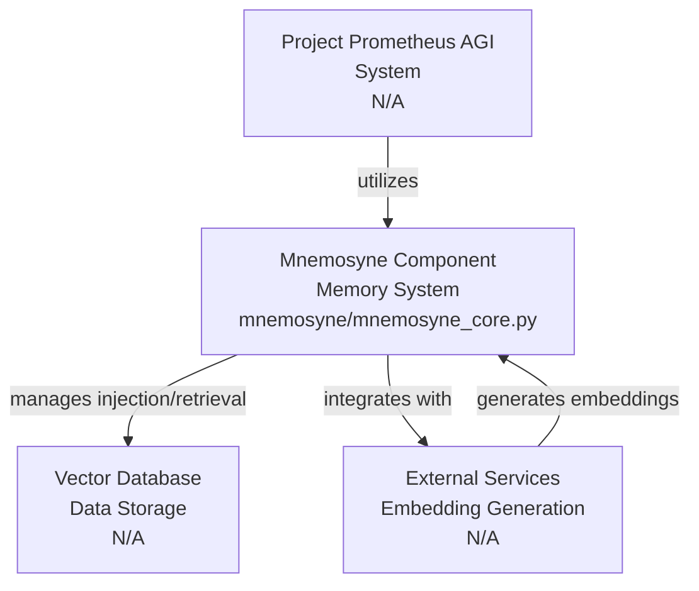
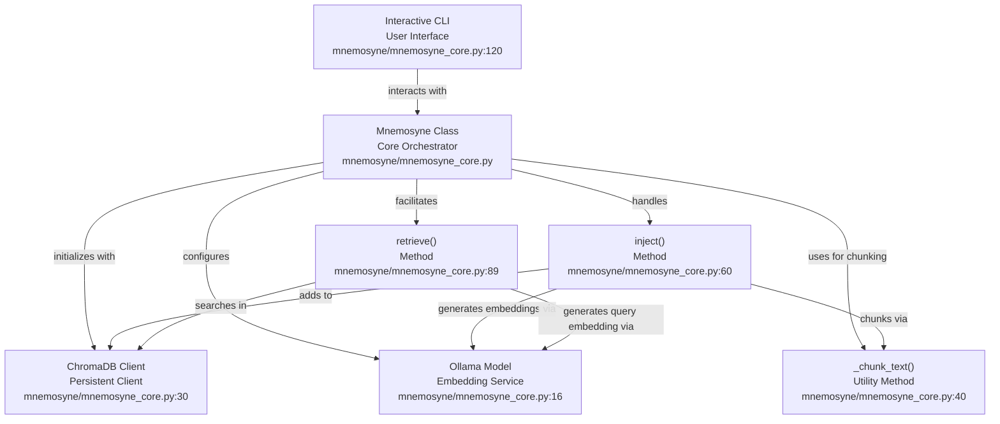

# Codebase Research Report

## Query
Investigate the "Mnemosyne" component in detail. Focus your analysis on these key files:
1. mnemosyne_core.py (mnemosyne/mnemosyne_core.py)

Provide insights about the component's main responsibilities and functionality and how it integrates with other system components

## Answer
# Mnemosyne Component Analysis

## High-Level Architecture

The **Mnemosyne** component serves as the foundational memory system within the Project Prometheus AGI. Its primary responsibility is to manage the injection and retrieval of information, acting as a persistent knowledge base. It integrates with external services for embedding generation and utilizes a dedicated vector database for efficient storage and retrieval of memory chunks.

## Mnemosyne Component Details

The core functionality of the Mnemosyne component is encapsulated within the [mnemosyne_core.py](mnemosyne_core.py) file, specifically through the `Mnemosyne` class.

### **Mnemosyne** (`Mnemosyne` class in [mnemosyne_core.py](mnemosyne_core.py))

The `Mnemosyne` class is the central orchestrator for memory operations.

*   **Purpose**: To provide a robust and interactive system for storing and querying textual information, enabling the AGI to access and utilize past "experiences" or "knowledge." It abstracts the complexities of text processing, embedding generation, and vector database interactions.

*   **Internal Parts**:
    *   **Initialization (`__init__`)**: Sets up the connection to the [ChromaDB](mnemosyne_core.py:30) persistent client, creating or retrieving the specified collection. It configures the embedding model (`OLLAMA_MODEL` from [mnemosyne_core.py:16]) and prefixes for storage and query.
    *   **Text Chunking (`_chunk_text`)**: A utility method ([mnemosyne_core.py:40]) responsible for breaking down large input documents into smaller, manageable chunks (paragraphs or groups of sentences). This is crucial for effective embedding and retrieval.
    *   **Memory Injection (`inject`)**: This method ([mnemosyne_core.py:60]) handles the process of adding new documents to the memory system. It first chunks the document using `_chunk_text`, then generates embeddings for each chunk using the [Ollama](mnemosyne_core.py:77) service, and finally adds these embeddings and their corresponding text chunks to the [ChromaDB collection](mnemosyne_core.py:84).
    *   **Memory Retrieval (`retrieve`)**: This method ([mnemosyne_core.py:89]) facilitates querying the memory system. It generates an embedding for the user's query using [Ollama](mnemosyne_core.py:97) and then performs a similarity search within the [ChromaDB collection](mnemosyne_core.py:102) to find the most relevant memory chunks.

*   **External Relationships**:
    *   **Ollama**: The `Mnemosyne` component integrates with the [Ollama](mnemosyne_core.py:10) service (configured via `OLLAMA_MODEL` in [mnemosyne_core.py:16]) to generate vector embeddings for both incoming document chunks and user queries. This is a critical dependency for semantic search capabilities.
    *   **ChromaDB**: It utilizes [ChromaDB](mnemosyne_core.py:11) as its underlying vector database (persisted at `DB_PATH` from [mnemosyne_core.py:17]). ChromaDB stores the generated embeddings and their associated text, enabling efficient similarity-based retrieval.
    *   **Command-Line Interface (CLI)**: The `mnemosyne_core.py` script also provides an [interactive CLI](mnemosyne_core.py:120) for direct user interaction, allowing manual injection, retrieval, and counting of memories. This CLI serves as a direct interface for testing and managing the memory system.

---
*Generated by [CodeViz.ai](https://codeviz.ai) on 7/12/2025, 3:56:32 PM*
